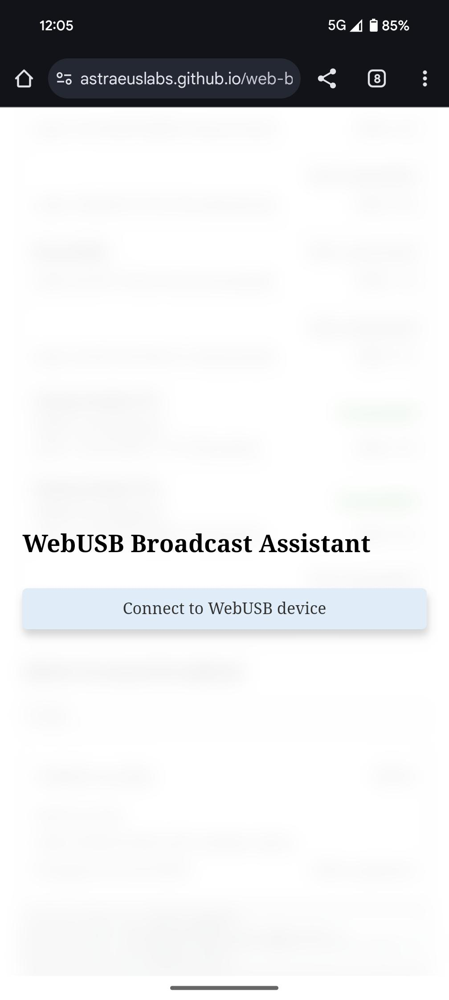
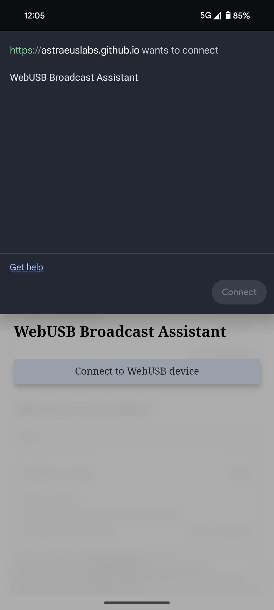
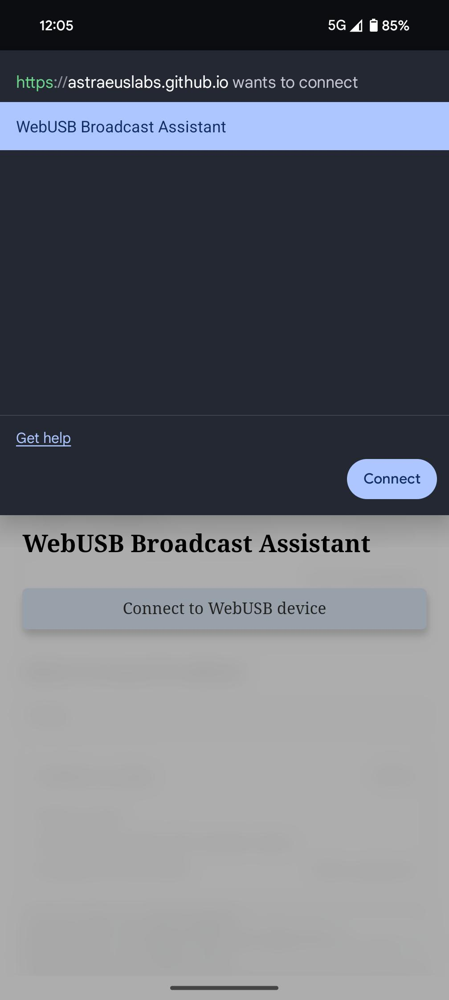
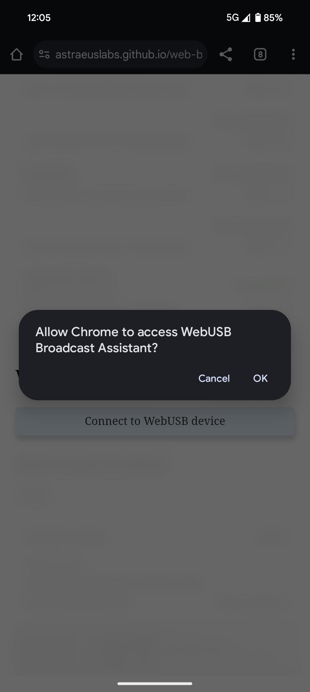
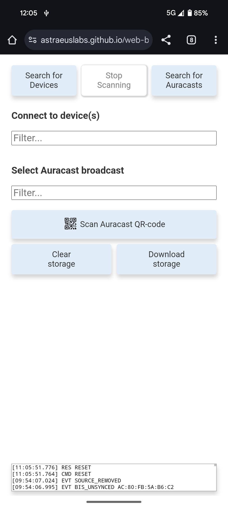

# Web Broadcast Assistant

## Starting the web application

Go to https://astraeuslabs.github.io/web-broadcast-assistant/?log=y&storage=y&details=y

> NOTE: The extra query parameters are there to enable additional febug features

The web page should now look like this:

Insert a dongle with the Web Assistant firmware and click `Connect to WebUSB Device`.

Now the browser will present a list of compatible USB devices found:

Select the `WebUSB Broadcast Assistant` device and press `connect` and allow access.

  &nbsp;&nbsp;&nbsp;
  

> NOTE: On mobile browsers, these steps are required every time.  On desktop, the permission granted is remembered and used on subsequent connects (and the application connectes immediately).

On successful connection, the web page should look like this:

## Main UI components

## Search for devices (Broadcast Sinks)

## Search for Auracasts (Broadcast Sources)

## Standard flow

* Search for Auracasts (Broadcast sources)
* Search for Devices (Broadcast Sinks)
* Stop scanning
* Connect to a pair of earbuds (Broadcast Sinks) - either manually or by coordinated set search
* When successfully connected, select a source to play
* Wait for the connected devices to report back that they are synced and audio should be playing.
